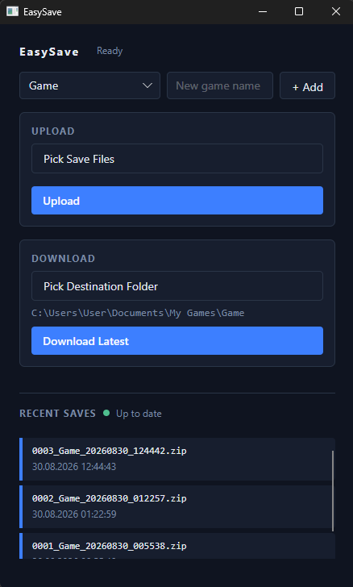

# EasySave

Desktop app for syncing game save files (Terraria, Valheim, The Forest.) between a group of people via Google Drive - so anyone can host, not just whoever has the latest save.

## How it works

1. Pick your save files in the app.
2. Click **Upload** - files get zipped and pushed to a shared Google Drive folder, versioned automatically.
3. Before your next session, click **Download Latest** to pull the newest save from whoever uploaded last.
4. A status indicator shows whether your local files are up to date with Drive.

Each game gets its own folder on Drive and its own config (save files, download path) saved locally.

## Setup

1. Go to [Google Cloud Console](https://console.cloud.google.com) -> create a project -> enable **Google Drive API**.
2. **OAuth consent screen** -> External -> add yourself as a test user.
3. **Credentials** -> Create Credentials -> OAuth client ID -> **Desktop app** -> download the JSON, rename to `credentials.json`, place it next to the app executable.
4. Run the app once - it opens a browser to authorize. This creates a `token_store/` folder next to the exe.
5. To let friends use the same shared Drive without logging in themselves: zip `token_store/` and send it to them, they place it next to their copy of the app.

Each game's folder is created automatically on Drive the first time you select that game in the app.